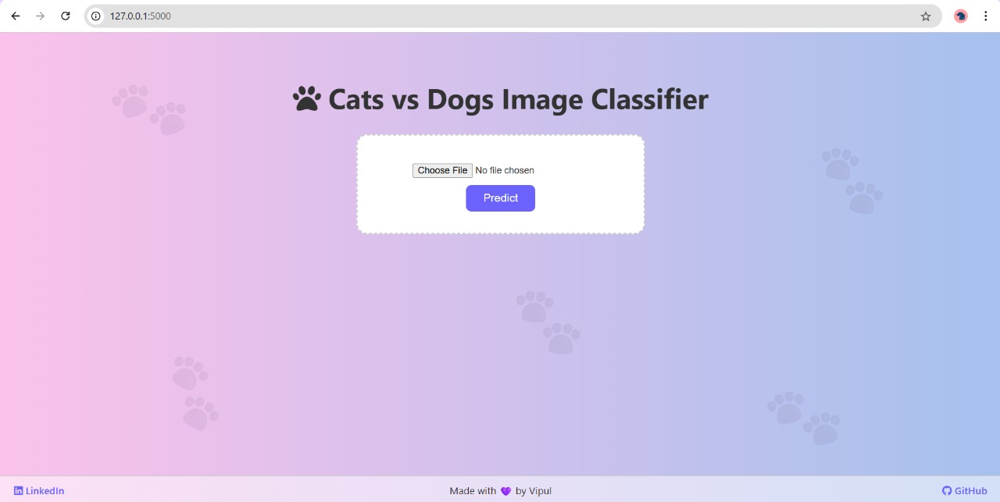
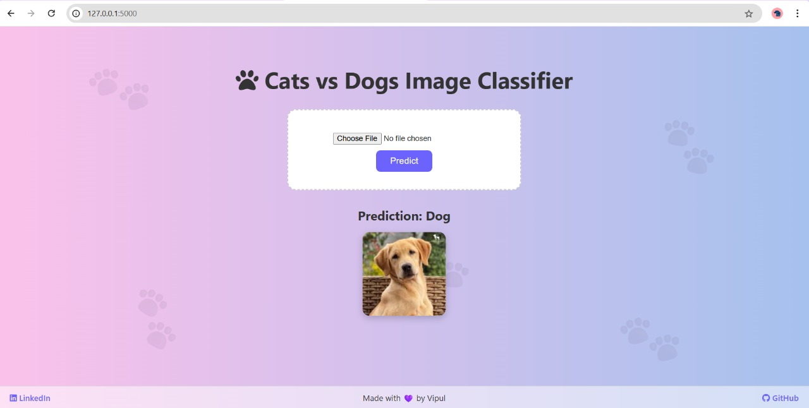

# Cats vs Dogs Image Classifier


A clean and user-friendly web application that classifies images as either a **Cat** or a **Dog** using a **Convolutional Neural Network (CNN)** built with TensorFlow and deployed through a Flask web server.

This project combines the power of deep learning with a visually engaging interface — perfect for showcasing your machine learning skills with real-world application.

---

## Demo

**Try it yourself:** Upload an image and get an instant prediction!

> **Model**: Custom CNN  
> **Accuracy**: Trained on Cats vs Dogs dataset (binary classification)

---

## 🖼 Screenshots

### 🕹️ Before Prediction



---

### ✅ After Prediction


 

---

## Tech Stack

| Layer        | Technologies              |
|--------------|---------------------------|
| **Frontend** | HTML5, CSS3, Font Awesome |
| **Backend**  | Python, Flask             |
| **Modeling** | TensorFlow, Keras         |
| **Tools**    | VS Code, Git, GitHub      |

---

## Features

- Upload an image (JPG/PNG)
- Predict using a trained CNN
- Stylish UI with gradient background & paw prints
- Shows uploaded image and result clearly
- Includes footer with LinkedIn & GitHub links

---

## Installation

> Clone & run locally in a virtual environment

```bash
git clone https://github.com/Vipul-0503/cats-vs-dogs-classifier.git
cd cats-vs-dogs-classifier

# Create virtual environment
python -m venv venv
.\venv\Scripts\activate  # Windows

# Install dependencies
pip install -r requirements.txt

# Run the app
python app.py
```

---

## Run the App

Once everything is set up:

Open your browser and go to:  
👉 [http://127.0.0.1:5000](http://127.0.0.1:5000)

---

## Model Details

- **Custom CNN** built and trained using **Keras**
- Binary classification: `0 = Cat`, `1 = Dog`
- Final `.keras` model is saved and loaded into the app
- Preprocessing includes resizing and normalization

---

## 📁 Project Structure

```bash
cats-vs-dogs-webapp/
│
├── app.py                      # Flask app
├── cats_vs_dogs_cnn.keras      # Trained model
├── requirements.txt            # Dependencies
├── templates/
│ └── index.html                # UI template
├── static/
│ └── uploads/                  # Uploaded images
├── README.md
└── .gitignore
```

---

## 🔗 Connect with Me

Made with 💜 by **Vipul**

- 🌐 [LinkedIn](https://www.linkedin.com/in/vipul-458b70310)
- 💻 [GitHub](https://github.com/Vipul-0503)

---

## 📃 License

## 📃 License

This project is licensed under the **Apache License 2.0**.  
See the [LICENSE](LICENSE) file for full details.
  
You are free to **use**, **modify**, **distribute**, and **fork** this project, provided that proper attribution is given and any changes are noted.

---

## ⭐ Bonus Ideas for the Future

- Add drag-and-drop image upload
- Add webcam capture functionality
- Deploy on **Render**, **PythonAnywhere**, or **Heroku**
- Extend model to classify multiple animals (e.g. rabbit, panda)

---

> ⭐ If you like this project, consider giving it a **star** on GitHub!


